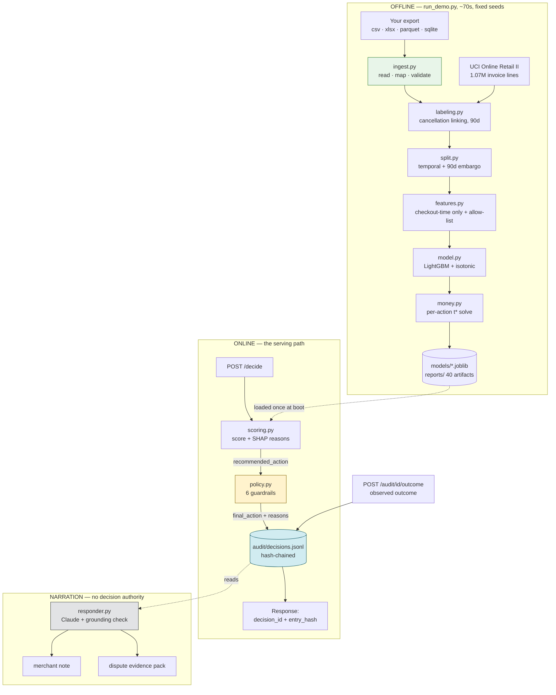

# Architecture — Return-Risk Scorer

Razorpay AI Buildathon · Track 02 (AI Risk Manager) · **defense-only**

This document describes how the system is built and why it is built that way. For *what
it achieves* and the evidence behind the numbers, see [`README.md`](README.md); for the
model's limits and the ways it can be wrong, see [`MODEL_CARD.md`](MODEL_CARD.md).

---

## 1. The one design decision everything else follows from

**Statistics recommend. Policy decides. The ledger remembers. The LLM only narrates.**

Those four responsibilities are separate modules, and the separation is load-bearing
rather than tidy-minded:

| Layer | Owns | Must never |
|---|---|---|
| **Model** (`model.py`, `scoring.py`) | A calibrated probability and a cost-optimal threshold | Know about guardrails, rupee caps, or who is asking |
| **Policy** (`policy.py`) | Whether an action is *permitted* on this order, right now | Change the score |
| **Ledger** (`audit.py`) | An immutable record of what was decided and why | Be edited after the fact |
| **Responder** (`responder.py`) | Merchant-readable prose over a decision already made | Influence, reorder, or contribute to a decision |

The tempting shortcut — hand an LLM the order and ask what to do — is rejected on
purpose. It would make the decision unreproducible, uncalibrated, and impossible to
defend to a payment network six months later. The model in this repo is a modest
signal (AUC-PR 0.341); the *system* around it is what makes a modest signal safe to act
on.

---

## 2. System diagram



The dotted edges matter: the model is **read** at boot, never retrained in the request
path, and the responder **reads** the ledger rather than sitting between the request and
the decision.

---

## 3. Request lifecycle

A `POST /decide` does exactly seven things, in this order:

1. **Assemble features.** `ScoringService.to_feature_row` builds one row carrying
   exactly `FEATURE_COLUMNS`. Customer history comes from the persisted profile store;
   an unknown customer gets the honest (and riskier) new-customer defaults.
2. **Score.** LightGBM + the isotonic calibrator. This number is identical to what
   `/score` returns and to what `reports/` measures — governance must not move it.
3. **Explain.** SHAP contributions mapped to reason templates. Wrapped in a `try` — an
   explanation failure must never fail a score.
4. **Price.** The rupee expected loss and expected saving for the chosen intervention.
5. **Gate.** `PolicyEngine.apply` runs the six guardrails in a fixed order and returns
   the action the system is permitted to take, plus a sentence per rule that fired.
6. **Record.** One append-only ledger entry, hashed and chained to its predecessor. The
   returned `decision_id` and `entry_hash` are the receipt.
7. **Optionally narrate.** Only if `explain=true`, and only after everything above is
   already final and written.

Steps 1–4 are the model's answer. Steps 5–6 are what makes it deployable.

---

## 4. The policy layer

Six rules, declared in `config.yaml`, applied in order. Each can **suppress**,
**downgrade**, **escalate**, or **hold out**.

| # | Rule | Effect | Why it exists |
|---|---|---|---|
| 1 | `min_order_value` | suppress | Below ₹1,500 the friction costs more than the return it prevents |
| 2 | `loyalty_shield` | suppress | A 25%-precision signal must not outrank a long clean history |
| 3 | `new_customer_cap` | downgrade | New customers are the model's **weakest** segment (1.48× lift) and the one a COD block hurts most |
| 4 | `human_review` | escalate | Above ₹2,00,000 a human decides. Bounded autonomy, stated as a number |
| 5 | `daily_action_cap` | escalate | One drift event must not action the whole book |
| 6 | `selective_labels_holdout` | holdout | 5% of flagged orders are deliberately let through so retraining labels stay unbiased |

Two of these are the model card's admissions turned into enforced code. Rule 3 exists
because `MODEL_CARD.md` says new customers are where the model is worst — a system that
can still hit them with the harshest action has not actually acknowledged that. Rule 6
exists because README §9 argues that acting on every flagged order destroys the labels
you need; arguing for a holdout is cheap, running one costs real money.

**Action severity is derived, not hardcoded.** The ordering comes from each action's
`conversion_loss_prob` in the cost model, so a new intervention declared in YAML slots
into the ordering with no code change — the same config-driven property
`test_config_drives_behaviour.py` already asserts for thresholds.

**The guardrails cost money, and that is reported rather than hidden.** Some suppressed
orders were genuine returns we chose not to prevent. The dashboard's governance tab
shows how many of the last 200 decisions a guardrail changed.

---

## 5. The audit ledger

One JSON object per decision, appended to `audit/decisions.jsonl`, never edited.

```
entry_hash = SHA256({seq, decision_id, recorded_at, prev_hash, ...decision fields})
```

Each record carries the hash of the one before it. Editing any past entry changes its
hash, which breaks the `prev_hash` of every entry after it, and `verify()` reports the
exact sequence number where the chain parts.

**This is tamper evidence, not tamper proofing.** It does not stop someone rewriting the
whole file from scratch, and it is not meant to — the realistic internal threat is a
single quiet row edit, and that is precisely what it catches.
`tests/test_audit.py` attacks it five ways, including the sophisticated case of editing
a row *and* recomputing its own hash (which still fails, at the next link).

**Outcomes go in a separate file.** `POST /audit/{id}/outcome` writes to
`outcomes.jsonl`, because a ledger whose rows change after the fact is not a ledger.

**What is recorded** is enough to replay a decision without the model: the score, the
threshold and which action it belonged to, the rupee amounts, the reason codes, every
guardrail that fired with its explanation, the model version, and a fingerprint of the
config that priced it.

**Scale caveat, stated plainly.** JSONL plus a process-level lock is a demo-scale
implementation. Two worker processes would race on `prev_hash`. The *interface* is the
part meant to survive — behind it belongs an append-only log or a database sequence — and
`verify()` would detect the violation rather than hide it.

---

## 6. The responder, and why it cannot lie

The only LLM in the system. It writes two artifacts, both over decisions that are
already final and already written to the ledger:

- **Merchant note** — three sentences an ops person can forward.
- **Dispute evidence pack** — the structured record for a disputed return. The evidence
  table is assembled deterministically from the ledger; only the narrative paragraph is
  generated. `tests/test_responder.py` asserts the two are byte-identical with and
  without an LLM.

Three enforced properties:

1. **It cannot invent numbers.** Every figure it is allowed to state is passed in
   explicitly, and `_ungrounded_figures` re-reads the output afterwards. A note stating
   a rupee amount we did not supply is **discarded** and the template is used instead.
   This is the "verifier" half of Track 02, pointed at our own output.
2. **It cannot fail the request.** No credentials, no `anthropic` package, a timeout, a
   rate limit, a refusal — every path falls back to a deterministic template. A judge
   cloning this repo with no API key gets a complete working demo; only the fluency of
   one sentence changes.
3. **It says which one you got.** Every response carries `generated_by`
   (`claude` / `template` / `template (fallback)`) and, on fallback, the reason.

Model: `claude-opus-5` at `low` effort — this is short factual writing, not reasoning.

`tests/test_decision.py::test_the_responder_cannot_change_a_decision` hands the
responder a hostile model that tries to reverse the outcome, then asserts the ledger row
is byte-identical.

---

## 7. Failure behaviour

Named as a design property because the brief asks for it.

| Failure | Behaviour |
|---|---|
| No trained model on disk | Service **boots degraded**. `/health` says which component is down; scoring routes return 503 naming the fix (`python run_demo.py`); `/audit/*` keeps working |
| Corrupt model file | Same — the exception is caught and reported, not fatal |
| Ledger directory unwritable | Scoring still works; audit routes 503 |
| No API credentials | Deterministic templates, flagged as such |
| LLM invents a figure | Output discarded, template used, reason reported |
| SHAP explainer fails | Score returns with an empty reason list rather than erroring |
| Unknown action requested | 422 listing the valid actions |
| Batch over 500 | 413 |
| Torn line in the ledger | Reading skips it; `verify()` reports it |

A risk service that refuses to boot tells an on-call engineer nothing. One that reports
*which* component is down tells them everything.

---

## 8. The ingest front door

The pipeline is written against one schema, and every guarantee it makes — the leakage
allow-list, the 90-day embargo, the right-censoring rule — is expressed in terms of it.
So bringing your own data adds a **front door**, not a second pipeline:

```
your file -> read_any -> suggest_mapping -> validate -> to_canonical -> the same 12 steps
```

`to_canonical` emits exactly what `load_uci` emits. Nothing downstream knows or cares
where the rows came from, which is the only version of this feature worth shipping — a
parallel "custom data" path would drift from the tested one and quietly stop making the
same promises.

Reads CSV, TSV, Excel, Parquet, JSON/JSONL, SQLite (`.db`/`.sqlite`, largest table
picked automatically) and zips of any of those.

**Three design rules.**

1. **Never guess a required column.** `suggest_mapping` matches on names and values and
   returns a *suggestion*; `validate` runs regardless, the CLI prints the mapping before
   training, and the dashboard makes every field an overridable dropdown. A file whose
   required columns cannot be identified is refused. The failure being guarded against —
   a model trained on the wrong date column — is silent, confident and useless.
2. **Use ground truth when it exists.** Flag-mode files know which order came back, so
   `labeling.label_from_flags` attaches the label directly. Reusing the
   cancellation-matching heuristic there would pin returns to the wrong order whenever a
   customer repeats a SKU, mislabelling both. Censoring and history rules are still
   shared — those are about time, not discovery.
3. **Surface every assumption.** The assumed return lag, the currency conversion, and a
   collapsing SKU-prefix category are each reported rather than applied silently. Each
   one changes what the model means.

**Validation refuses** files under ~500 rows, under 180 days of history, unparseable
dates, non-numeric quantity or price, or no return information at all. Warnings — short
history, missing customer ids, a collapsing SKU prefix — are reported and the run
continues.

**Isolation.** A dashboard run writes to `reports_user/` + `models_user/` through the
existing `paths` config, so experimenting never overwrites the committed UCI baseline.
The Reports tab reads either.

---

## 9. Module map

```
config.yaml              every number the system uses - costs, guardrail bounds, model params
run_demo.py              one command, regenerates all 40 artifacts

src/returnrisk/
  data/loader.py         UCI download + parquet cache + synthetic generator
  data/ingest.py         read any export, map columns, validate, convert
  data/labeling.py       cancellation heuristic + ground-truth flag path
  features.py            checkout-time features + the leakage allow-list
  split.py               temporal split + 90-day embargo
  model.py               LightGBM + isotonic calibration
  metrics.py             the honest metric panel
  money.py               cost algebra, per-action threshold solve
  explain.py             SHAP + reason codes + the leakage audit
  scoring.py             the model's answer          <- unchanged by governance
  policy.py              the six guardrails          <- what the system may do
  audit.py               hash-chained ledger         <- what the system did
  decision.py            composes the three above
  responder.py           Claude prose + grounding check
  baselines / sensitivity / stability / segments / capacity / selective_labels
  plots.py               every chart, one house style

app/api.py               FastAPI - /score, /decide, /audit/*, /policy, /respond/*
app/dashboard.py         Streamlit - 6 tabs incl. upload & all reports
tests/                   178 tests
```

---

## 10. API surface

| Endpoint | Purpose |
|---|---|
| `GET /health` | Liveness, model version, per-component status |
| `GET /actions` | Interventions and their cost-optimal thresholds |
| `GET /policy` | **The guardrails in force** — published so integrators know the bounds on our autonomy |
| `POST /score` | What the model thinks. Stateless, nothing recorded |
| `POST /score/batch` | Up to 500 orders |
| `POST /decide` | **What the system does.** Scores, gates, records. `?explain=true` adds the note |
| `POST /decide/batch` | Portfolio-level view of the guardrails' effect |
| `GET /audit/verify` | Walk the hash chain |
| `GET /audit/stats` | Volumes, guardrail hit counts, chain state |
| `GET /audit/recent` | Recent decisions |
| `GET /audit/{id}` | Replay one decision as recorded, plus its outcome |
| `POST /audit/{id}/outcome` | Close the loop |
| `POST /respond/note` | Merchant-readable prose for a recorded decision |
| `POST /respond/dispute` | Structured dispute evidence pack |

`/score` and `/decide` both exist and return different things on purpose. Collapsing
them would quietly make the reported savings unachievable, because they would stop
accounting for the orders policy refuses to act on.

---

## 11. Reproducibility

Fixed seeds throughout, pinned requirements, temporal split with an embargo, and a
config fingerprint recorded on every decision so a past decision can be tied to the
exact cost assumptions that priced it.

```bash
make install && make test && make demo
```

CI runs the suite on Python 3.11/3.12/3.13 against the synthetic dataset, so it never
needs the 45 MB UCI download, and finishes with an end-to-end pipeline smoke run.
