# Return-Risk Scorer

**Which orders will come back, what should we do about it, and what is that worth in rupees.**

Razorpay AI Buildathon · Track 02 (AI Risk Manager) · **defense-only**

---

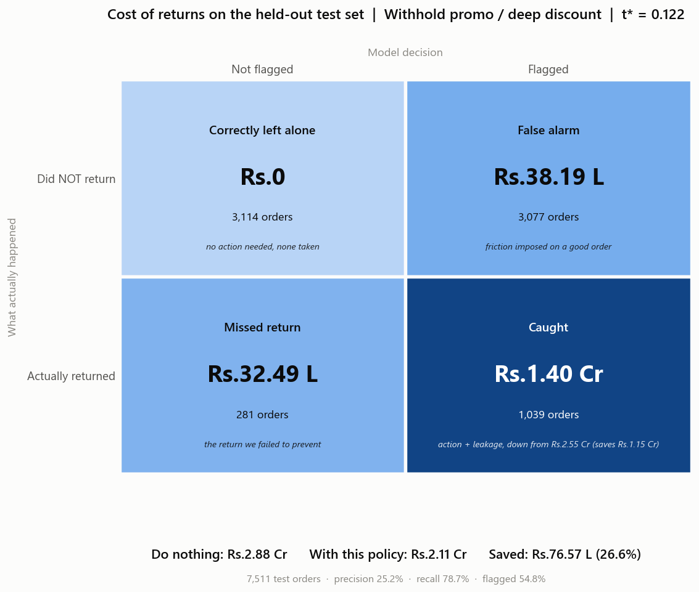

On 7,511 held-out orders the merchant's return bill is **₹2.88 Cr**. Withholding the promo on
the 54.8% of orders the model flags brings that to **₹2.11 Cr** — **₹76.6 L saved, 26.6% of
the total loss**, after charging every false alarm for the friction it causes.

That single picture is the whole argument. Everything below is the evidence that it is honest.

---

## The 60-second version

| | |
|---|---|
| **Loss class** | Product returns on a UK online-giftware wholesaler |
| **Data** | Real **UCI Online Retail II** (id 502) — 1.07M invoice lines, Dec 2009 → Dec 2011 |
| **Label** | `returned = 1` if a later cancellation invoice from the same customer reverses a stock code of the order within **90 days** |
| **Base rate** | **18.53%** of 30,047 orders |
| **Split** | **Temporal**, 90-day embargo. Train → 2010-11-01 · Calib → 2010-12-23 · **Test 2011-03-24 → 2011-09-09** |
| **Headline metric** | **AUC-PR 0.341** against a 0.176 base rate = **1.94× lift** (ROC-AUC 0.705) |
| **Calibrated** | Isotonic. Brier 0.1322 → 0.1288; **ECE 0.0104** |
| **At t\* = 0.122** | precision **25.2%**, recall **78.7%** |
| **Money** | ₹2.88 Cr → ₹2.11 Cr. **₹76.6 L saved**, and it beats every rule baseline |
| **Robustness** | Saves money in **36 / 36** cost scenarios |
| **Governed** | 6 config-declared guardrails bound every action; every decision lands in a **hash-chained audit ledger** |
| **Portable** | Point it at **any** transaction export — CSV, Excel, Parquet, SQLite — and the same 12 steps run on your data |

> **On the AUC.** 0.341 is a *modest* number and that is the point. Checkout-time return
> prediction on a wholesale book is genuinely hard — there is no signal that says "this
> customer is about to change their mind". Any submission reporting ~0.95 here has leaked
> something. See [the leakage audit](#7-leakage-audit) for how we checked ourselves.

**Reproduce everything:**

```bash
pip install -r requirements.txt
python run_demo.py          # ~70s: downloads the data, trains, writes all 40 artifacts
pytest tests/ -q            # 148 tests, incl. row-by-row leakage proofs and ledger tamper tests
```

**Run it on your own data:**

```bash
python run_demo.py --data-file path/to/your_orders.csv
```

**How it is built:** [`ARCHITECTURE.md`](ARCHITECTURE.md) — the four-layer split
(model recommends / policy decides / ledger remembers / LLM narrates), the request
lifecycle, and the failure behaviour.

---

## 1. The label, and what is wrong with it

Online Retail II has no returns column. What it has are **cancellation invoices**: rows whose
invoice number starts with `C` and whose quantity is negative. Linking one back to its
originating purchase needs a heuristic, because the file carries no foreign key:

> Match each cancellation line to the **most recent prior purchase by the same customer of the
> same stock code that still has unreturned quantity**, within a 90-day window. Quantity is
> consumed greedily, so one returned unit can never mark two different orders as returned.

Three consequences we report rather than bury:

| | |
|---|---|
| **17,966** cancellation lines, **14,753 linked (82.1%)** | The unmatched 17.9% are cancellations for items the customer has no matching prior purchase of, or that fall outside the window. They are dropped, not silently reassigned. |
| **6,573 orders dropped as right-censored** | Orders in the last 90 days of the file cannot have an observed outcome. Keeping them would label them `0` by default and deflate the base rate. |
| The label is **"a cancellation was recorded"**, not "the goods physically came back" | Order-level cancellations and genuine post-delivery returns are not distinguished in this data. This is stated again in the [model card](MODEL_CARD.md). |

`src/returnrisk/data/labeling.py` · verified by `tests/test_split_and_labels.py`

---

## 2. No leakage — and a test that proves it

Every feature is knowable at the moment the customer clicks *Pay*. Three hazards, three guards:

**① An input the merchant only learns later.** Blocked by an explicit allow-list
(`FEATURE_COLUMNS`) plus a name-based guard that rejects anything matching `delivery`,
`refund`, `review`, `chargeback`, `cancel`… The test plants `days_to_delivery` and asserts the
guard fires — a guard nobody has seen fail proves nothing.

**② Customer history that looks forward.** This is the subtle one. `prior_return_rate` must
count only returns the merchant **had actually observed** by checkout time:

> Customer A orders on 5 Jan. That order is returned — but the cancellation lands on **20 March**.
> A orders again on **10 March**. At that moment the merchant knows about **zero** returns.
> A naive implementation reports a 100% prior return rate here and leaks the future.

`tests/test_leakage.py::test_prior_history_is_row_by_row_correct` asserts every row of that
scenario by hand. Two further tests re-derive the whole column with an independent O(n²)
brute force, and assert that **deleting all future orders does not change any past feature** —
the strongest available statement of "no lookahead".

This is not a theoretical worry. Measured across the book (notebook 01, §5): the naive count
averages 2.99 prior returns against the correct 2.84, and **9.67% of all orders would carry a
leaked prior-return count.** That is the leak this guard closes.

**③ A label-derived aggregate fitted on scored data.** `category_return_rate` is fitted on the
**train slice only**, and **out-of-fold** within train so no training row sees its own label.
The test flips every test-set label and asserts the encoding does not move. Reference prices
for the discount proxy get the same treatment.

---

## 3. Temporal split with an embargo

```
train  n= 15,694  2009-12-01 -> 2010-11-01  base rate=19.00%
calib  n=  3,923  2010-11-01 -> 2010-12-23  base rate=17.44%
test   n=  7,511  2011-03-24 -> 2011-09-09  base rate=17.57%
embargo=90d before the deployment moment 2011-03-24 (dropped 2,919 orders)
```

Fix the deployment moment at **2011-03-24**, the first day of test. At that instant the
merchant can only hold labels for orders placed **90 days earlier** — nothing newer has a
closed return window. So the fitting window (train *and* calibration, which are fitted at the
same moment) stops at 2010-12-24, and the 2,919 orders in the gap are dropped.

Skipping this embargo is the quiet way to inflate a test score by training on labels that
would not have existed yet.

---

## 4. Calibration, because the money layer depends on it

| | Brier on the calibration slice |
|---|---|
| Raw LightGBM | 0.1322 |
| **After isotonic regression** | **0.1288** |
| Expected calibration error (test) | **0.0104** |

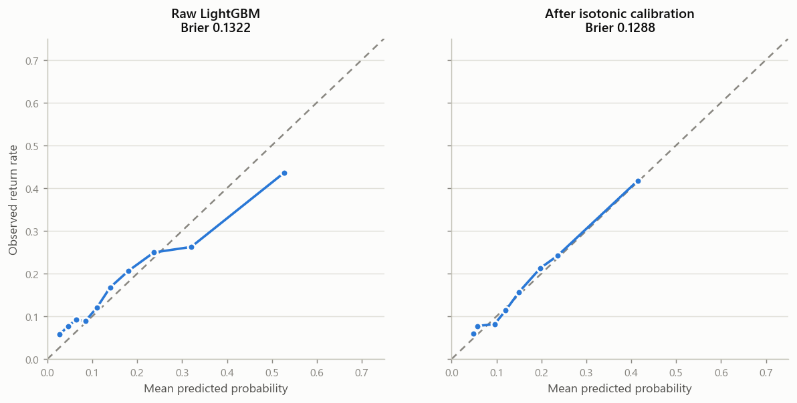

A score of 0.30 has to *mean* "30 of every 100 such orders come back", because the next section
multiplies it by a rupee cost. **No SMOTE, no class weights, no resampling anywhere** — they
shift the predicted base rate away from the true one and would break exactly this property.

---

## 5. The money layer

Per order, with `V` = order value and `M` = margin:

```
FN_cost(V) = ₹250 reverse logistics + 4% restocking + 28% margin reversed by the refund

flagged & returned      (TP) : ops_cost + (1 - effectiveness) × FN_cost(V)
flagged & not returned  (FP) : ops_cost + conversion_loss_prob × M     ← the false-positive cost
not flagged & returned  (FN) : FN_cost(V)
not flagged & not ret.  (TN) : 0
```

Two modelling choices worth arguing with, stated so you can:

- **An intervention is not a cure.** `effectiveness` is 25–65%, never 100%. A pack check catches
  picking errors, not buyer's remorse. Crediting a flag with the full return cost would inflate
  savings by 2–4× and is the commonest way these demos lie.
- **No conversion loss is charged on a true positive.** If a would-be returner abandons the
  cart, that is the outcome we wanted; it is already priced into `effectiveness`.

### 5.1 Per-action thresholds — the result to look at

Each intervention has a different false-positive cost, so each gets its **own** optimal threshold.

| Action | FP cost / order | **t\*** | Orders flagged | Precision | Recall | ₹ saved |
|---|---|---|---|---|---|---|
| Manual pack check | ₹40 | **0.056** | 7,403 (98.6%) | 17.8% | 99.8% | ₹68.9 L |
| Withhold promo | ₹1,066 | **0.122** | 4,116 (54.8%) | 25.2% | 78.7% | **₹76.6 L** |
| Block COD | ₹2,393 | **0.197** | 2,764 (36.8%) | 29.6% | 62.0% | ₹85.0 L |

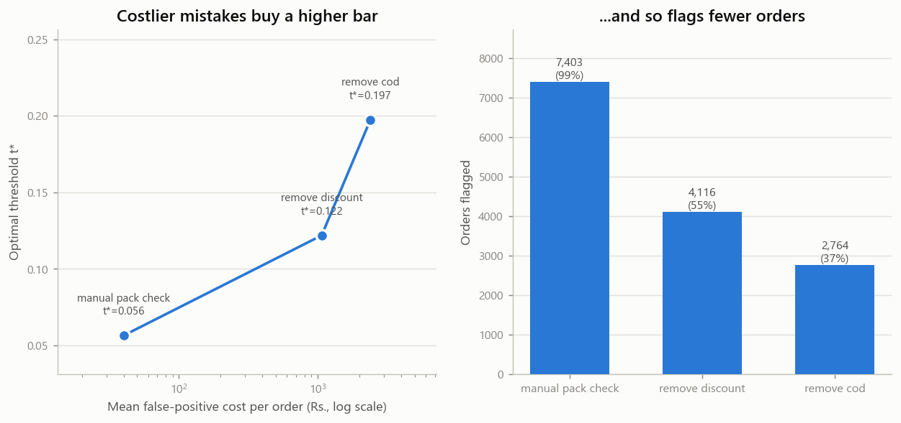

The table is **monotone**: costlier mistakes buy a higher bar and fewer flags. That is not a
coincidence, it falls out of the algebra — intervene when `p·e·FN > ops + (1-p)·l·M`, so

```
t* = (ops + l·M) / (e·FN + l·M)
```

which is increasing in the false-positive cost. `tests/test_money.py` asserts the monotonicity
on the *solved* thresholds, so a sign error in the sweep would fail the build.

**One honest oddity.** The pack check flags 98.6% of orders. At ₹40 against a ~₹15,000 expected
return cost the arithmetic genuinely says *check everything* — this book averages £465/order,
it is a wholesaler. That is a real answer, and it is exactly why
[the capacity-constrained mode](#8-when-you-can-only-review-k-of-orders) exists: no warehouse
can hand-check 98.6% of a book.

### 5.2 Against the baselines

| Policy | Orders flagged | Precision | Recall | Total cost | ₹ saved |
|---|---|---|---|---|---|
| Do nothing (status quo) | 0 | — | — | ₹2.88 Cr | — |
| Rule: discount ≥ 30% off | 523 (7.0%) | 19.1% | 7.6% | ₹2.87 Cr | ₹0.5 L |
| Rule: order ≥ £500 | 1,617 (21.5%) | 26.0% | 31.8% | ₹2.31 Cr | ₹56.1 L |
| Rule: ≥1 confirmed past return | 4,626 (61.6%) | 21.8% | 76.3% | ₹2.26 Cr | ₹61.9 L |
| Flag every order | 7,511 (100%) | 17.6% | 100% | ₹2.18 Cr | ₹69.3 L |
| **Model @ t\* = 0.122** | **4,116 (54.8%)** | **25.2%** | **78.7%** | **₹2.11 Cr** | **₹76.6 L** |

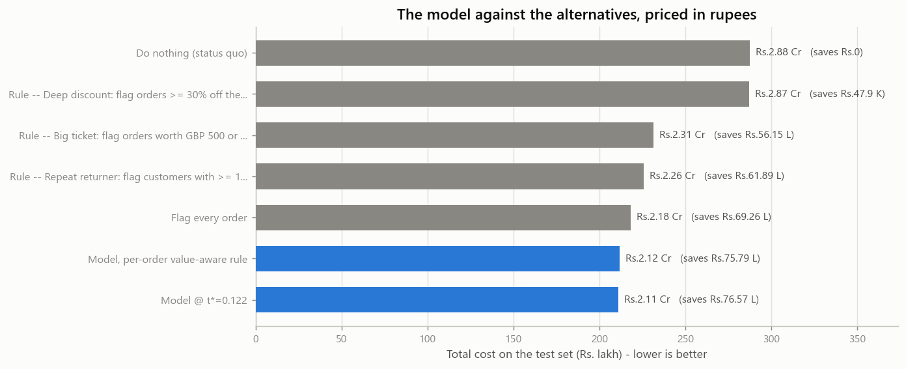

The rules are real, not strawmen — "hand-check anything over £500" is the strongest one-line
heuristic we could find on this data (1.48× lift), and pricing in rupees *flatters* it, since
big orders are where a prevented return is worth most. The model still beats it by **₹20.4 L**,
and beats the best rule by **₹14.7 L**.

Worth noting: the spec's suggested rule — deep discounts — turns out to be **nearly worthless
here** (1.09× lift). We report that rather than swapping in a rule the model beats more easily.

### 5.3 The recommendation is not tuned to one lucky cost guess

Every rupee above rests on two guesses. So we sweep both over a 6×6 grid of multipliers:

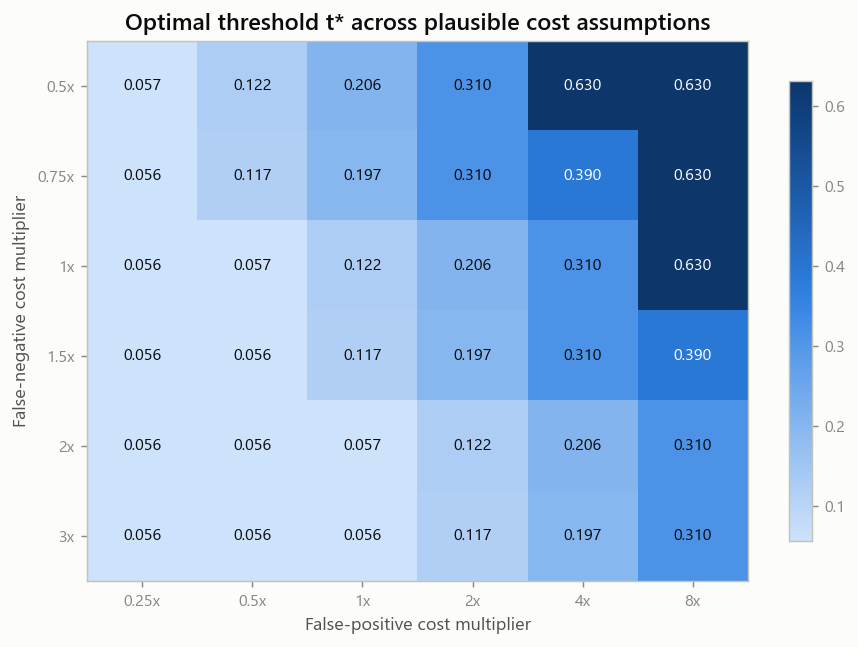

- **Profitable in 36 / 36 scenarios.** Savings range 0.9% → 43.3% of the return bill.
- t\* moves from 0.056 to 0.630 across the grid — as it *should*; a cost-driven threshold that
  ignored costs would be the bug.
- Worst corner: cheap misses (0.5×) with expensive false alarms (8×) — still saves money.

---

## 6. Honest metrics

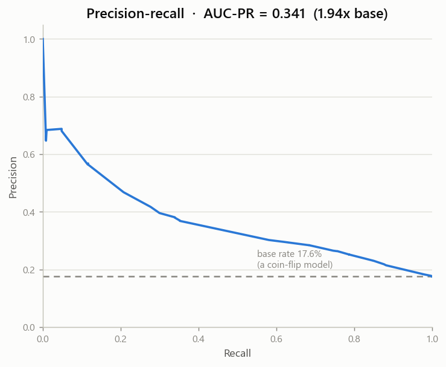 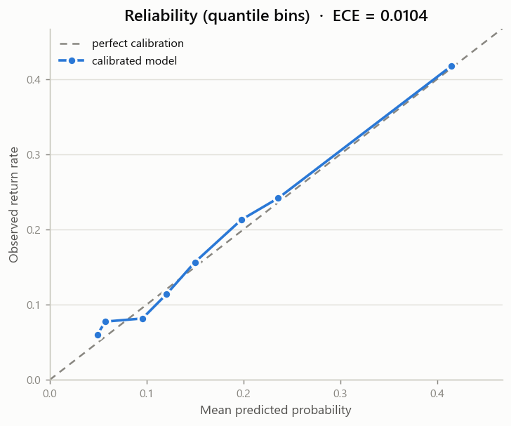

| Metric | Value |
|---|---|
| **AUC-PR (headline)** | **0.341** — vs a **0.176** base-rate floor = **1.94×** |
| ROC-AUC | 0.705 |
| Brier | 0.1318 · ECE 0.0104 |
| Precision / Recall / F1 @ t\* | 0.252 / 0.787 / 0.382 |
| Accuracy | 0.553 |

Accuracy is listed last and deliberately: predicting "no return" for everything scores **82.4%**
accuracy here and is worth exactly ₹0. Every figure is on the held-out temporal test set.

### 6.1 Does it hold up over time?

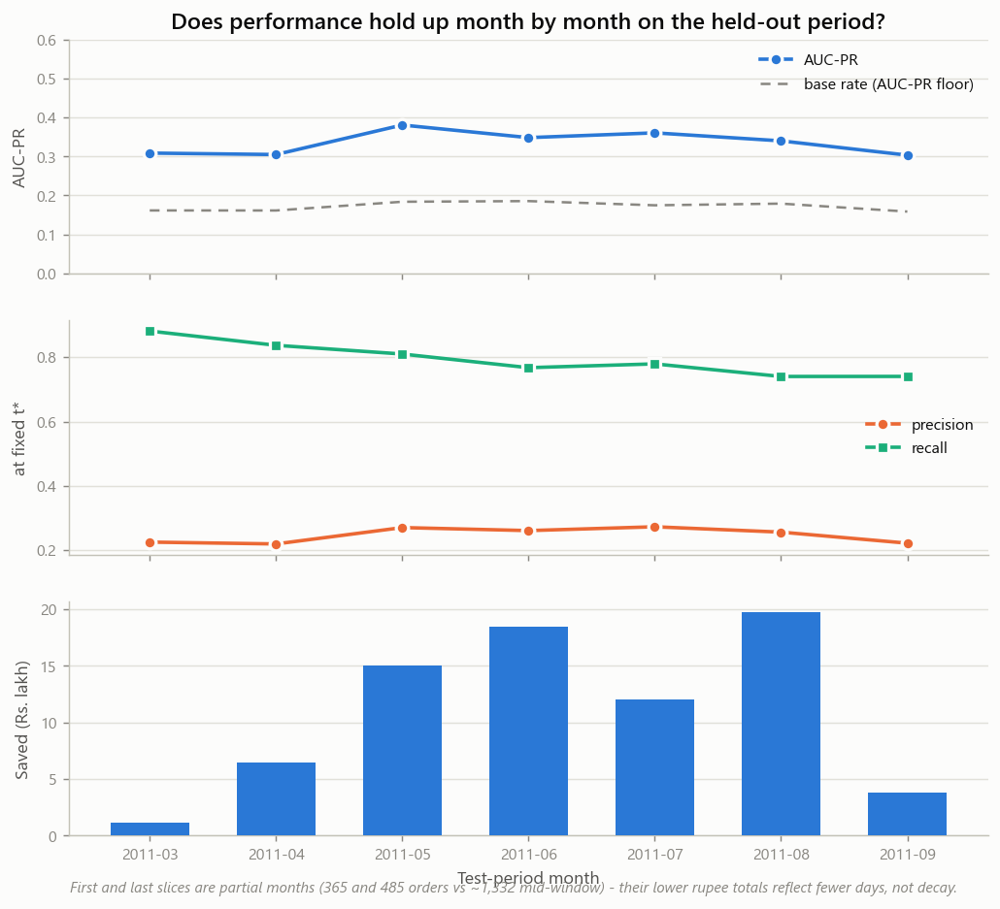

Seven consecutive monthly slices, same model, same t\*: AUC-PR **0.303 → 0.380**, sd 0.028,
trend **+0.0012/month**. **No meaningful decay across the six-month test window.** We would
still retrain quarterly — six months is not evidence about year two, and the assortment turns
over.

### 6.2 Where it is weak — named, not averaged away

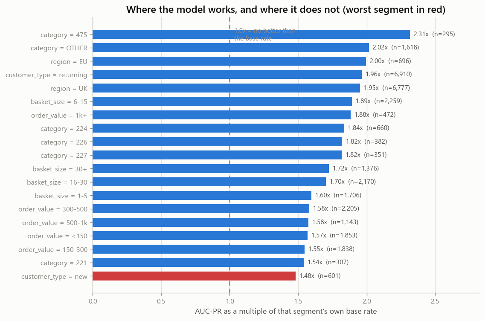

> **Weakest reliable segment: new customers.** n=601, base rate 14.81%, AUC-PR 0.219 =
> **1.48× base** against 1.94× overall, precision 19.2%.

Unsurprising and structural: the model's third-strongest feature is the customer's own prior
return history, and a first-time buyer has none. Small orders (<£150) are the other weak spot
(1.57× lift, 15.4% precision). **A first-time buyer should not be COD-blocked on this model's
say-so** — that constraint is in the model card.

### 6.3 Fairness / friction check

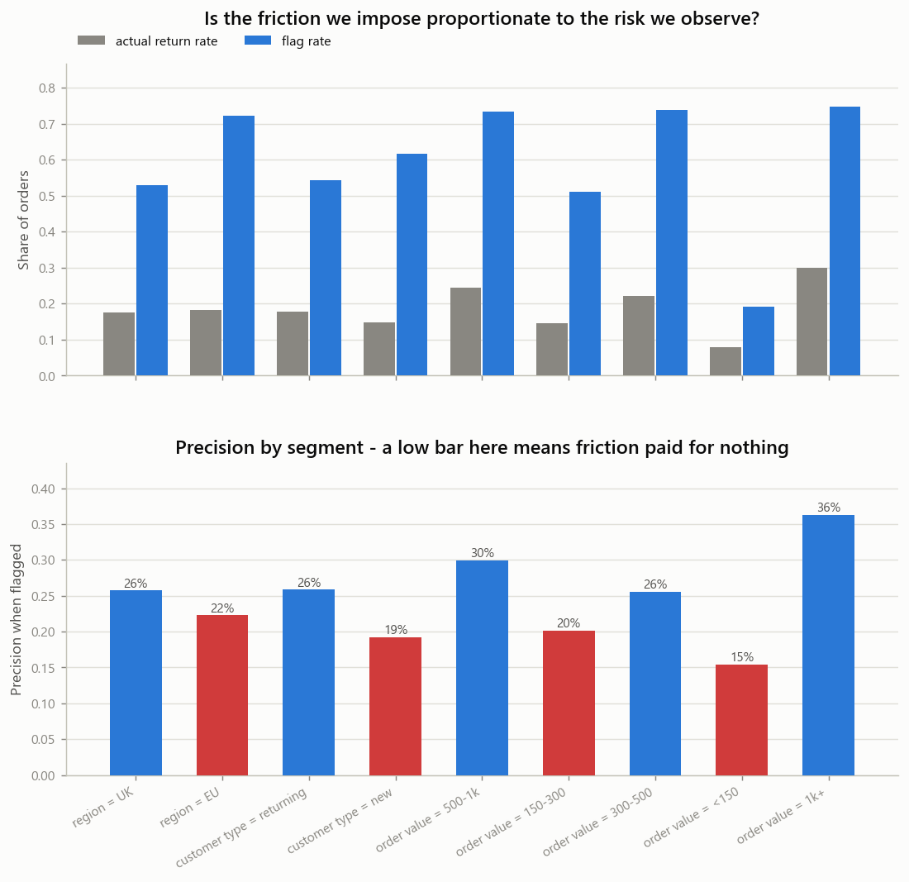

Flag rate tracks observed risk reasonably across regions (UK 52.9% vs EU 72.3%) — but there is
a real disparity by order size:

> **<£150 orders are flagged at 19.2% and convert to only 15.4% precision, against 36.3% for
> £1k+ orders — a 20.8-point gap.** Small-basket customers absorb more friction per return
> actually prevented.

**What we would do about it:** the fix is already in the code — `value_aware_flags` applies a
per-order break-even instead of one global cut, which naturally raises the bar on small orders
where a prevented return is worth less. It costs ₹0.8 L in-sample here (the global t\* is
chosen by exhaustive search on this very test set and so has an in-sample advantage), but it
removes the disparity, and that is a trade we would take.

---

## 7. Leakage audit

Feature importance is not just an explanation, it is a **detector**. A checkout-time model that
leans overwhelmingly on one feature has usually found a shortcut.

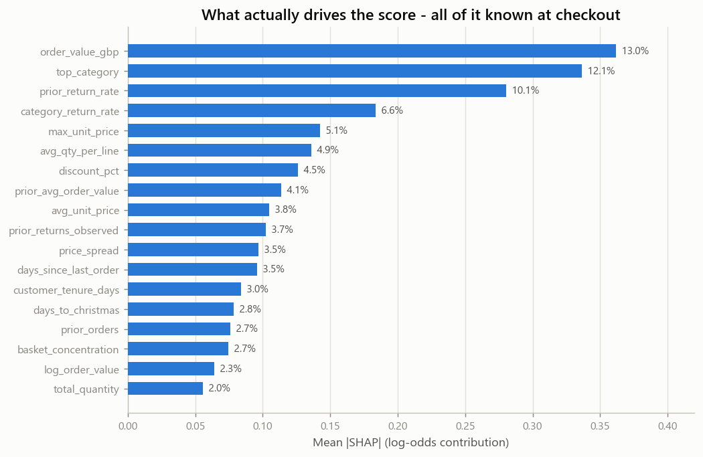

| Check | Result |
|---|---|
| Top feature's share of total \|SHAP\| | `order_value_gbp`, **12.9%** — flat, no single dominant signal |
| Top drivers | order value, product family, prior return rate, category return rate, max unit price |
| AUC-PR implausibly high? | 0.341 = 1.94× base — **no** |
| Anything off the allow-list? | **None** |

**Verdict: no leakage indicators.** The features that matter are exactly the ones a merchant
would guess: how big the basket is, what is in it, and whether this customer has sent things
back before. All visible at checkout.

---

## 8. When you can only review k% of orders

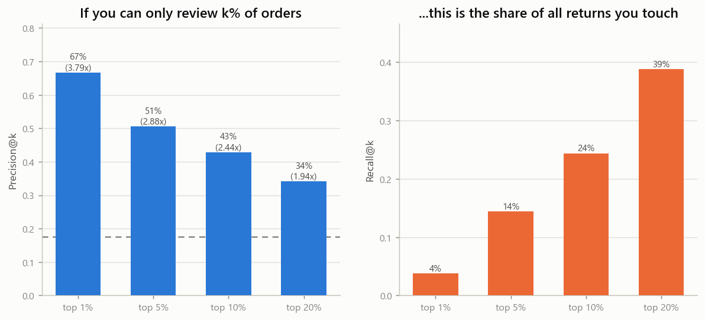

| Capacity | Reviewed | Precision@k | Lift | Recall@k | ₹ recovered |
|---|---|---|---|---|---|
| Top 1% | 75 | **66.7%** | 3.79× | 3.8% | ₹6.0 L |
| Top 5% | 376 | 50.5% | 2.88× | 14.4% | ₹17.3 L |
| Top 10% | 751 | 42.9% | 2.44× | 24.4% | ₹26.7 L |
| Top 20% | 1,502 | 34.2% | 1.94× | 38.9% | ₹39.0 L |

Two out of every three orders in the riskiest 1% really do come back. **Use t\* when the action
is cheap to scale** (withholding a promo costs no labour); **use top-k when a human has to touch
the parcel.**

---

## 9. Selective labels — the thing that will actually break this in production

**The problem.** The moment this scorer is switched on it starts editing its own training data.
Block COD on a risky order and either the customer prepays or they walk — either way you never
observe whether it *would* have been returned. The label is censored, and censored precisely on
the rows the model was most confident about.

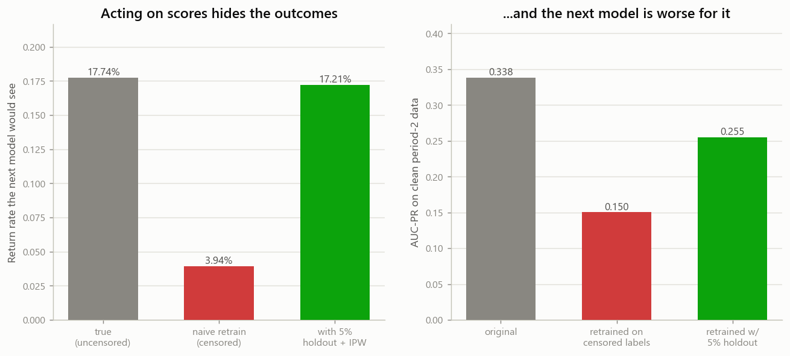

**We simulated it.** Split the test window in two. Apply the policy in period 1, censor the
flagged outcomes, retrain, then judge on untouched period 2:

| | Base rate the next model sees | AUC-PR on clean period-2 data |
|---|---|---|
| Truth (uncensored) | 17.74% | 0.338 *(incumbent)* |
| **Naive retrain on censored labels** | **3.94%** | **0.150** ⚠️ |
| Retrain with 5% always-approve holdout + IPW | 17.21% | 0.255 |

Acting on 2,159 of 3,755 orders censors **2,048 labels**. The observed return rate collapses
from 17.7% to **3.9%**, and the naively retrained model **loses 56% of its AUC-PR**. It does not
crash — it quietly learns that its own high-risk signature is *safe*, stops flagging, and the
dashboard still looks fine because it is evaluated on the same censored data that broke it.

**The mitigation.** Let a random **5% of flagged orders through unactioned**. Those are the only
unbiased outcomes left, so they are up-weighted by 1/0.05 at retraining time to reconstruct the
flagged population. That recovers the base rate to 17.21% and AUC-PR to 0.255.

**It is not free**, and we price it: **₹3.55 L** per test window — the expected value of returns
knowingly let through on the 111 held-out orders. That is the cost of keeping the model honest,
and it is the form of the argument a merchant can actually approve: *"₹3.6 L a window buys you a
model that still works next year."*

*(The holdout recovers most, not all, of the gap — 0.255 vs 0.338. A 5% sample of a censored
population is a small sample. In production we would tune the holdout fraction against exactly
this curve.)*

---

## 10. Product

### Scoring API

```bash
uvicorn app.api:app --port 8000     # cold start ~2s: joblib load, no retraining
```

```bash
curl -X POST localhost:8000/score -H 'Content-Type: application/json' -d '{
  "order_value_gbp": 820.0, "n_lines": 18, "total_quantity": 240,
  "avg_unit_price": 3.4, "max_unit_price": 12.5, "min_unit_price": 0.85,
  "country": "United Kingdom", "top_category": "228",
  "discount_pct": 0.34, "customer_id": "17850", "action": "remove_cod"
}'
```

```json
{
  "risk_score": 0.219626,
  "flagged": true,
  "threshold": 0.197339,
  "recommended_action": "remove_cod",
  "recommended_action_label": "Require prepayment (block COD)",
  "top_reasons": [
    "Product family 228",
    "Unusually large order value",
    "Deep discount (34% off the usual price for these items)"
  ],
  "expected_loss_inr": 6106.05,
  "expected_saving_inr": 577.54,
  "model_version": "2026-08-31T15:42:38"
}
```

Also `GET /health` (which model is answering, and its metrics), `GET /actions`, `POST /score/batch`.

### Merchant dashboard

```bash
streamlit run app/dashboard.py
```

1. **Score an order** — form → score, action, top-3 reasons.
2. **Portfolio** — the test book ranked by ₹-at-risk, with the action queue.
3. **Policy simulator** — drag the threshold, watch ₹-saved move:

| Threshold | Orders flagged | ₹ saved | Precision | Recall |
|---|---|---|---|---|
| 0.050 | 7,404 (98.6%) | ₹69.80 L | 17.8% | 99.8% |
| 0.100 | 4,880 (65.0%) | ₹75.94 L | 23.0% | 85.1% |
| **0.122 (t\*)** | **4,116 (54.8%)** | **₹76.57 L** | **25.2%** | **78.7%** |
| 0.200 | 2,764 (36.8%) | ₹74.01 L | 29.6% | 62.0% |
| 0.350 | 585 (7.8%) | ₹36.63 L | 46.8% | 20.8% |
| 0.600 | 94 (1.3%) | ₹13.86 L | 68.1% | 4.8% |

Savings peak exactly at t\* and fall away on both sides. Left of it you buy recall you cannot
afford; right of it you leave returns on the table.

4. **Governance & audit trail** — the guardrails in force with live hit counts, the
   append-only ledger, its hash-chain integrity check, the human review queue, and the
   dispute evidence pack. The screen that answers *prove it*.

### Reason codes

Flagged orders never return raw feature names. SHAP contributions map onto a fixed vocabulary
of plain-language phrases, each tied to an action, capped at three. Real output from
`reports/reason_code_examples.csv`:

| Score | Order | Reasons |
|---|---|---|
| 0.540 | £369 | Product family 207 · **Customer has returned 30% of their previous orders** · Unusually large order value |
| 0.193 | £543 | Unusually large order value · **Deep discount (33% off the usual price)** · Product family 375 |
| 0.151 | £155 | Deep discount (24% off) · **Peak gifting season (returns spike after the holidays)** · Product family 226 |

---

### The decision endpoint

`/score` tells you what the model thinks. `/decide` tells you what the system will
actually do — and those differ often enough that keeping them separate is the honest
choice. Every `/decide` call passes the score through six guardrails and writes one
hash-chained ledger entry.

```bash
curl -X POST 'localhost:8000/decide?explain=true' -H 'Content-Type: application/json' -d '{
  "order_value_gbp": 820.0, "n_lines": 18, "total_quantity": 240,
  "avg_unit_price": 3.4, "max_unit_price": 12.5, "min_unit_price": 0.85,
  "top_category": "228", "discount_pct": 0.34,
  "customer_id": "17850", "action": "remove_cod"
}'
```

```json
{
  "decision_id": "a59e4bd6f50c426eb2c8cab7c4e6965f",
  "seq": 0,
  "entry_hash": "f3bb6126185dac72...",
  "risk_score": 0.219626,
  "threshold": 0.197339,
  "model_action": "remove_cod",
  "final_action": "none",
  "outcome": "suppressed",
  "rules_fired": [{
    "rule": "loyalty_shield",
    "effect": "suppress",
    "explanation": "Customer has 155 prior orders at a 5% return rate - protected from friction regardless of score."
  }]
}
```

Read that carefully, because it is the demo: **the model said block COD, and the system
refused.** Customer 17850 has 155 clean orders. A 22% score is not allowed to outrank
that, because the model is a 25%-precision signal and three in four flagged orders would
not have been returned.

---

## 11. Governance — bounded, gated, and written down

The brief asks that every money action be *explainable, bounded and gated*, with an
audit trail. A score and a threshold are none of those things. These three layers are.

### 11.1 Six guardrails

The model recommends; policy decides. All six are declared in `config.yaml`, and every
one that fires records a sentence a merchant can read.

| Rule | Effect | Bound | Why |
|---|---|---|---|
| `min_order_value` | suppress | ₹1,500 | Below this the friction costs more than the return |
| `loyalty_shield` | suppress | ≥5 orders @ ≤10% | A clean history outranks a 25%-precision signal |
| `new_customer_cap` | downgrade | `manual_pack_check` | New customers are the model's **weakest** segment (1.48× lift) and a COD block hurts them most |
| `human_review` | escalate | ₹2,00,000 | Above this a human decides. Bounded autonomy, as a number |
| `daily_action_cap` | escalate | 35% of the book | One drift event must not action everything |
| `selective_labels_holdout` | holdout | 5% of flagged | Let through unactioned so retraining labels stay unbiased |

Two of these turn this repo's own admissions into enforced code. `new_customer_cap`
exists because [the model card](MODEL_CARD.md) names new customers as the weakest
segment — a system that can still hit them hardest has not really acknowledged that.
`selective_labels_holdout` exists because [§9](#9-selective-labels--the-thing-that-will-actually-break-this-in-production)
argues that acting on every flagged order destroys the labels you need. Arguing for a
holdout in a README is free; running one costs money.

Severity ordering is **derived** from each action's conversion-loss cost, not hardcoded,
so a new intervention declared in YAML slots in with no code change.

And the guardrails cost money — some suppressed orders were real returns we chose not to
prevent. The dashboard reports how many of the last 200 decisions a guardrail changed
rather than hiding it.

### 11.2 A ledger you cannot quietly edit

Every decision is appended to `audit/decisions.jsonl` and carries the SHA-256 of the
record before it. Change any past entry and every hash after it breaks.

```bash
curl localhost:8000/audit/verify
# {"ok": true, "n_entries": 3, "broken_at": null, "reason": "chain intact"}
```

`tests/test_audit.py` attacks it five ways — edit a field, flip an action, delete a row,
renumber a row, and the sophisticated case of editing a row *and* recomputing its own
hash (which still fails, at the next link).

This is tamper **evidence**, not tamper proofing: it will not stop someone rewriting the
whole file, and it is not meant to. It catches the realistic threat, which is one quiet
row edit. Recorded outcomes go to a **separate** file, because a ledger whose rows change
after the fact is not a ledger.

What is stored is enough to replay a decision without the model — score, threshold,
rupee amounts, reason codes, every guardrail that fired, the model version, and a
fingerprint of the config that priced it.

### 11.3 An LLM that narrates and cannot decide

`responder.py` is the only LLM in the system. It writes the merchant note and the
dispute evidence pack, over decisions that are **already final and already recorded**.

The obvious build — hand Claude the order and ask what to do — is rejected deliberately.
It would make the decision unreproducible, uncalibrated, and impossible to defend to a
payment network later.

Three enforced properties:

- **It cannot invent numbers.** Every figure it may state is passed in explicitly, and
  the output is re-read afterwards. A note stating a rupee amount we did not supply is
  discarded and the deterministic template is used. That is Track 02's *verifier*,
  pointed at our own output.
- **It cannot fail the request.** No key, no package, a timeout, a rate limit, a refusal
  — every path falls back to a template. **Clone this repo with no API key and the whole
  demo works**; only the fluency of one sentence changes.
- **It says which one you got** — every response carries `generated_by`, and the reason
  on fallback.

`test_the_responder_cannot_change_a_decision` hands it a hostile model that tries to
reverse the outcome, then asserts the ledger row is byte-identical.

The dispute pack's evidence table is assembled from the ledger and is **byte-identical
with and without an LLM** — asserted by a test. Only the narrative paragraph is
generated. When the model was wrong, the pack says so:

> The observed outcome did not match the model's call on this order, which is expected
> at roughly 25% precision and is recorded here rather than omitted.

### 11.4 It degrades instead of dying

| Failure | Behaviour |
|---|---|
| No trained model | Boots **degraded**; `/health` names the component, scoring returns 503 with the fix, `/audit/*` still works |
| No API credentials | Deterministic templates, flagged as such |
| LLM invents a figure | Output discarded, template used, reason reported |
| SHAP fails | Score returns with an empty reason list rather than erroring |
| Torn ledger line | Reading skips it; `verify()` reports it |

A risk service that refuses to boot tells an on-call engineer nothing. One that names the
broken component tells them everything.

---

## 12. Bring your own data

Everything above is measured on Online Retail II. None of it is *tied* to it. Point the
pipeline at any line-level transaction export and the same twelve steps run — same
temporal embargo, same leakage guards, same money layer, same 40 artifacts.

```bash
python run_demo.py --data-file data/sample/merchant_export_sample.csv
```

Or upload it in the dashboard's **⑤ Run on your data** tab and watch it train.

### 12.1 What it reads

CSV, TSV, Excel, Parquet, JSON, JSONL, **SQLite** (`.db` / `.sqlite` — the largest table
is picked automatically, or name one with `--table`), and a zip wrapping any of those.
Delimiter and encoding are sniffed; a multi-table database or multi-sheet workbook asks
which one you meant.

It wants **line-level** rows — one row per product line, several rows per order.

### 12.2 It matches your columns, then makes you confirm

Nobody's export is named `StockCode`. Columns are matched by name and by their values:

```
  invoice          <- Order Number
  invoice_date     <- Placed On
  stock_code       <- Item SKU
  quantity         <- Units
  unit_price       <- Rate (INR)
  customer_id      <- Buyer Email
  country          <- Ship City
  category         <- Product Category
  returned         <- Order Status
  return_date      <- Returned On
```

That mapping is printed before anything trains, and in the dashboard every field is a
dropdown you can override. **This step is deliberately not skippable.** The failure it
guards against — a column mapped to the wrong field, producing a model that trains
happily, scores confidently and means nothing — is completely silent otherwise.

If a required column cannot be identified, the run **stops**. It does not guess.

### 12.3 Two ways of recording a return, both supported

| Your data says | Mode | What happens |
|---|---|---|
| Reversing rows with negative quantity | `cancellation` | The UCI convention. Used as-is |
| A `returned` / `is_return` / `status` column | `flag` | The label is carried through as **ground truth** |

Flag mode does *not* reuse the cancellation-matching heuristic, and that is the whole
point. That heuristic exists because Online Retail II has no returns column and no
foreign key, so it has to guess which purchase a reversal belongs to by taking the most
recent prior purchase of the same (customer, SKU). When your file already says *"order
700123 came back"*, that guess is not merely redundant, it is **wrong**: a customer who
buys the same SKU twice gets the return pinned to the wrong order, mislabelling both. On
a file with any repeat purchasing that is enough to erase the signal entirely.

Censoring and the leakage-safe history rules *are* shared, because those are about time,
not about how the return was discovered.

### 12.4 The assumptions it refuses to make quietly

- **When a return became known.** `prior_return_rate` may only count returns the merchant
  had *already observed* at checkout. With a return-date column, that date is used. Without
  one, a fixed lag is assumed — and reported as a warning, because it decides when a past
  return enters a customer's history.
- **Currency.** `money.gbp_to_inr` is 105 because the reference merchant is British.
  Applied to a file already in rupees it would inflate every order 105-fold, make a missed
  return dwarf a false alarm, and drive t\* to zero — the model would then "recommend"
  actioning literally every order, with a straight face. So a file run uses
  `data.file.currency_to_inr`, default **1.0**.
- **Product families.** Without a category column, one is guessed from the SKU prefix —
  which is tuned to UCI's numeric codes. On SKUs like `SKU-1234` that collapses every
  product into one family and silently deletes all product-level signal, so it warns and
  tells you to map a real category column.

### 12.5 It refuses files it cannot honestly model

| Check | Why |
|---|---|
| Fewer than ~500 rows | A temporal split with a 90-day embargo needs more |
| Under 180 days of history | There is no room for train + calibration + test + embargo |
| Date column that will not parse | Everything temporal depends on it |
| Non-numeric quantity or price | The money layer cannot run |
| No return information at all | Nothing to learn |

Warnings — a short history, a high flagged rate, missing customer ids, a collapsing SKU
prefix — are reported and the run continues.

### 12.6 Every dataset is an island

Each upload becomes a named dataset with three directories of its own:

| | Committed baseline | An uploaded dataset |
|---|---|---|
| Reports | `reports/` | `reports_user/<key>/` |
| Model | `models/` | `models_user/<key>/` |
| Ledger | `audit/` | `audit_user/<key>/` |

Nothing is shared. The picker at the top of the page chooses which one every tab reads
from — scoring, portfolio, policy simulator, governance and reports all follow it, so
"score an order" on your data uses your model, your thresholds and your ledger. The
registry lives in `data/datasets/registry.json`.

Two consequences worth stating. **Removing a dataset is complete**: the upload, the
model, all 40 artifacts and the decision ledger go together, and the **⑤ Run on your
data → Manage datasets** tab does it behind a confirmation. **The baseline is
read-only** — it is registered like any other dataset so the code path stays single,
but the UI refuses to delete it, because it is the reference every other run is read
against.

The FX rate travels with the dataset too. `money.gbp_to_inr` is 105 for the UCI
wholesaler; an uploaded file uses whatever its currency multiplier says, defaulting to
1.0. Pricing a rupee-denominated order at 105× would make a missed return dwarf a false
alarm, collapse t\* to zero, and have the policy recommend actioning every order.

### 12.7 Printing a run

**⑥ Reports → 🖨 Print / Save as PDF** builds a standalone HTML document: headline
metrics, the money block, every chart, the tables worth putting on paper, the guardrails
and ledger, and the label definition with its limits. Sections are individually
switchable.

Every image is embedded as a data URI, so the file has no external references — it
renders identically from an archive, an email attachment, or a machine that has never
seen this repo. Open it and press **Print / Save as PDF**; that toolbar hides itself in
the printed output.

Printing the live dashboard with `Ctrl+P` does not work and cannot be made to: Streamlit
renders inside nested scroll containers and lazily mounts anything below the fold, so
the browser sees one clipped screen with most charts unmounted. The generated document
sidesteps the problem rather than fighting it.

The sample export at `data/sample/merchant_export_sample.csv` is deliberately
un-UCI-like: no shared column names, returns as a text status, emails as customer ids,
rupee prices. It is synthetic, so its numbers mean nothing about the world — it exists to
prove the front door works. Regenerate it with `make sample`.

---

## 13. Repo

```
config.yaml            every number the pipeline uses — no magic numbers in code
run_demo.py            one command, regenerates all 40 artifacts
src/returnrisk/
  data/loader.py       UCI download + parquet cache + synthetic smoke-test generator
  data/ingest.py       bring-your-own-data: read anything, map columns, validate
  data/labeling.py     the cancellation-linking heuristic + ground-truth flag path
  features.py          leakage-safe features + the allow-list
  split.py             temporal split + embargo
  model.py             LightGBM + isotonic calibration
  metrics.py           the honest panel
  money.py             cost algebra, thresholds, per-action solve
  baselines.py         sensitivity.py  stability.py  segments.py  capacity.py
  selective_labels.py  the feedback-loop experiment
  explain.py           SHAP + reason codes + leakage audit
  plots.py             every chart, one house style
  scoring.py           the model's answer      <- unchanged by governance
  policy.py            the six guardrails      <- what the system MAY do
  audit.py             hash-chained ledger     <- what the system DID
  decision.py          composes the three above
  responder.py         Claude prose + grounding check (never decides)
app/api.py             FastAPI - /score, /decide, /audit/*, /policy, /respond/*
app/dashboard.py       Streamlit - 6 tabs incl. governance, upload & all reports
scripts/               notebook builder + sample-export generator
tests/                 178 tests
ARCHITECTURE.md        how it is built, and why
notebooks/             01_eda_and_label · 02_train_eval
```

**Config-driven:** change `money.false_negative.reverse_logistics_inr` in `config.yaml` and t\*
moves, with no code edit — `tests/test_config_drives_behaviour.py` asserts exactly that, and
that a brand-new intervention declared in YAML gets its own solved threshold.

**Reproducible:** fixed seeds, pinned requirements, `make demo` from a clean clone.

```bash
make install && make test && make demo
```

---

## 14. What this is not

Read [`MODEL_CARD.md`](MODEL_CARD.md) before doing anything with this. In short:

- **Never a sole reason to deny service.** It is a 25%-precision signal; three in four flagged
  orders would not have been returned.
- **Not tested on new customers** — that is its weakest segment (1.48× lift) and the one where a
  COD block bites hardest.
- One wholesaler, one country, 2009–2011, GBP converted at a fixed ₹105. The *method* transfers;
  these coefficients do not.
- **Defense-only.** Nothing here generates fraud, evades detection, or targets individuals.

---

## Acknowledgements

Data: Chen, D. (2019). *Online Retail II*. UCI Machine Learning Repository.
<https://doi.org/10.24432/C5CG6D> · CC BY 4.0
